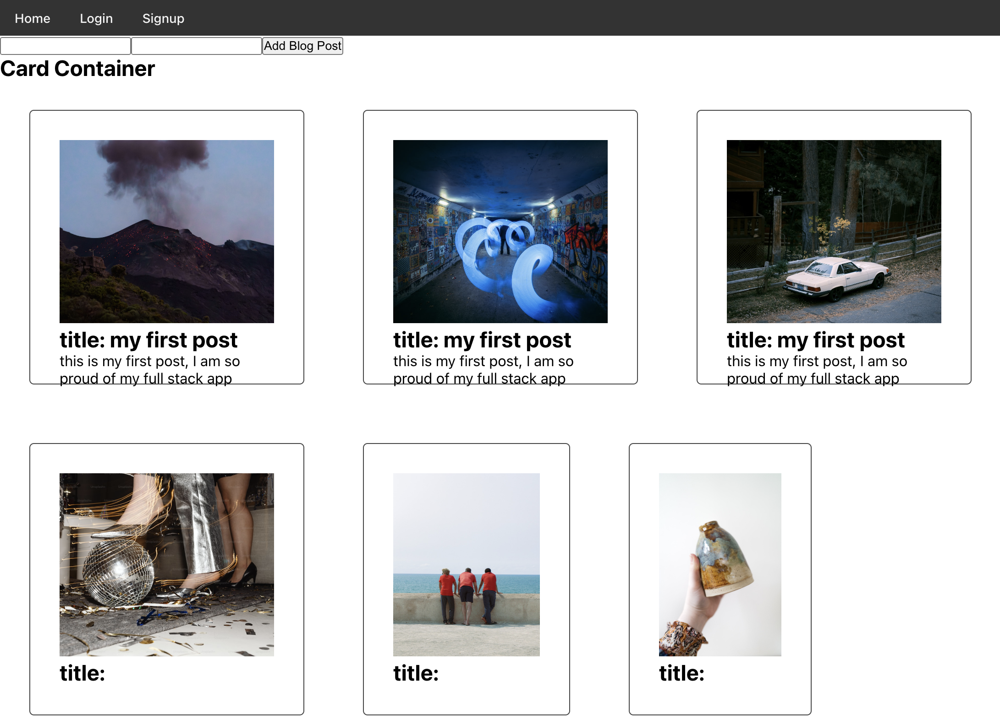

#My Blog App

This is the front-end for a full-stack blog app with login.

## Build instructions
1. git clone https://github.com/johnhsavin/frontend-blogapp.git
2. cd c12 johnhsavin/frontend-blogapp.git
3. npm i
4. npm start

##Backend Repo
[Click here to view the backend]
https://github.com/johnhsavin/backend-blogapp.git
